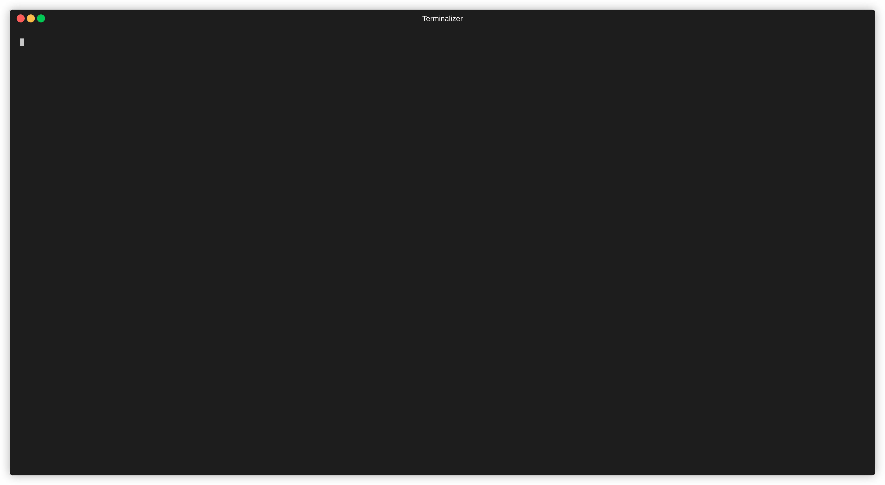

# Exdoc CLI

A CLI equivilent to the IEx h/1 helper.

## Installation

Install with `mix escript.install hex exdoc_cli`

Once installed, run `exdoc <Module>`

## Examples
  * exdoc Enum
  * exdoc Enum.flat_map
  * exdoc Enum.reduce/2

